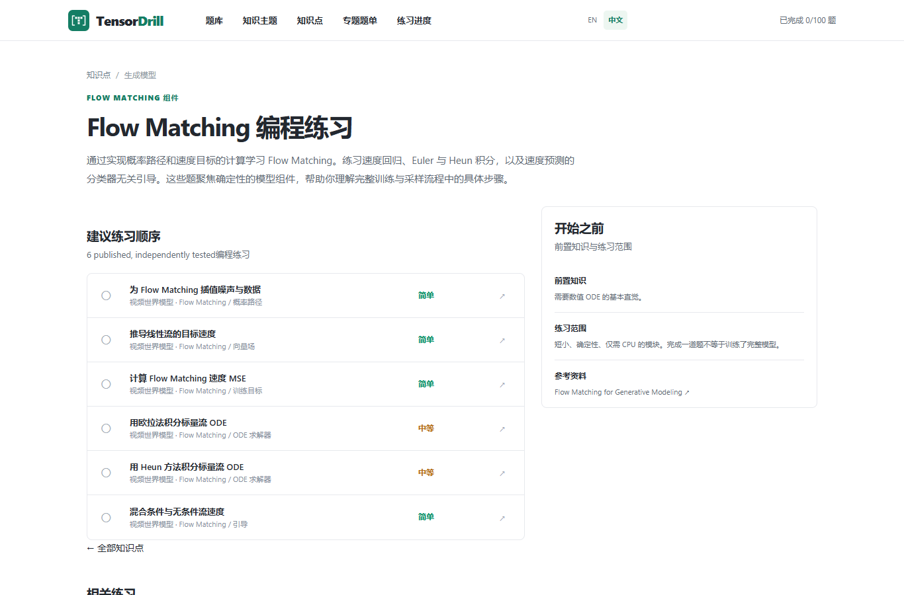

# Flow Matching 编程练习：用几行 Python 分清状态、目标速度与 Euler 更新

读生成模型时，很容易把插值公式、速度回归目标和采样更新混成一件事。把它们拆成三个小函数，反而更容易检查理解。

下面只讨论**从噪声走向数据的一条线性条件路径**。它是 Flow Matching 的入门例子，不代表所有概率路径或所有生成模型。理论背景可参考 [Flow Matching for Generative Modeling](https://arxiv.org/abs/2210.02747)。

## 1. 状态：此刻位于哪里？

约定 `t=0` 对应噪声 `x0`，`t=1` 对应数据 `x1`：

`x_t = (1-t) * x0 + t * x1`

```python
def interpolate(x0, x1, t):
    return (1.0 - t) * x0 + t * x1
```

标量例子：`x0=-2`、`x1=4`，则 `t=0.25` 时状态是 `-0.5`。它回答“走到了哪里”。

## 2. 目标速度：状态随时间怎样变化？

对这条路径求时间导数：

`d(x_t)/dt = x1 - x0`

```python
def target_velocity(x0, x1):
    return x1 - x0
```

上例速度是 `6`，并不是状态 `-0.5`。对固定的条件端点，这条路径的目标速度不随 `t` 变化；真实模型学习的是由状态和时间等条件决定的速度场，不能据此推断任何采样轨迹都恒速。

## 3. Euler 更新：怎样近似走下一步？

给定速度函数 `velocity(x, t)` 和步长 `dt`，显式 Euler 方法写成：

`x_next = x + dt * velocity(x, t)`

```python
def euler_step(x, t, dt, velocity):
    return x + dt * velocity(x, t)
```

如果从 `x=-2`、`t=0` 开始，速度函数恒为 `6`，取 `dt=0.25`，一步后也是 `-0.5`。这是该简单例子的精确结果；一般速度场中 Euler 存在数值误差，不能用一个恒速例子证明积分器普遍准确。

## 4. 用断言区分几个容易写错的地方

```python
assert interpolate(-2, 4, 0) == -2
assert interpolate(-2, 4, 1) == 4
assert interpolate(-2, 4, 0.25) == -0.5
assert target_velocity(-2, 4) == 6
assert euler_step(-2, 0, 0.25, lambda x, t: 6) == -0.5
assert euler_step(2, 0, 0, lambda x, t: 99) == 2
assert euler_step(2, 0, 0.25, lambda x, t: x) == 2.5
```

最后两条分别检查零步长和状态相关速度。常见错误是把目标速度的符号写反，或者更新时忘记乘步长。还要检查你阅读的论文采用哪一种时间方向；若端点约定相反，公式也要随之调整。

## 5. 下一步怎么练？

先闭卷写出这三个函数，再做向量版本和速度回归的均方误差，随后比较 Euler 与 Heun 在同一个非恒定速度场、同样步数下的结果。比较时记录误差和函数调用次数，不能仅凭运行一次就给方法排名。

如果希望直接在浏览器练习，[TensorDrill 的 Flow Matching 专题](https://tensordrill.com/zh/concepts/flow-matching/)已经把插值、目标速度、速度回归损失、Euler 和 Heun 拆成独立题目。题库也覆盖 Transformer、Diffusion、Agent 和世界模型；当前已发布 100 道原创题，后续持续扩充并维护测试。



练习的目标是能解释每一个量，看到失败用例时知道应该检查路径、目标还是求解器。
