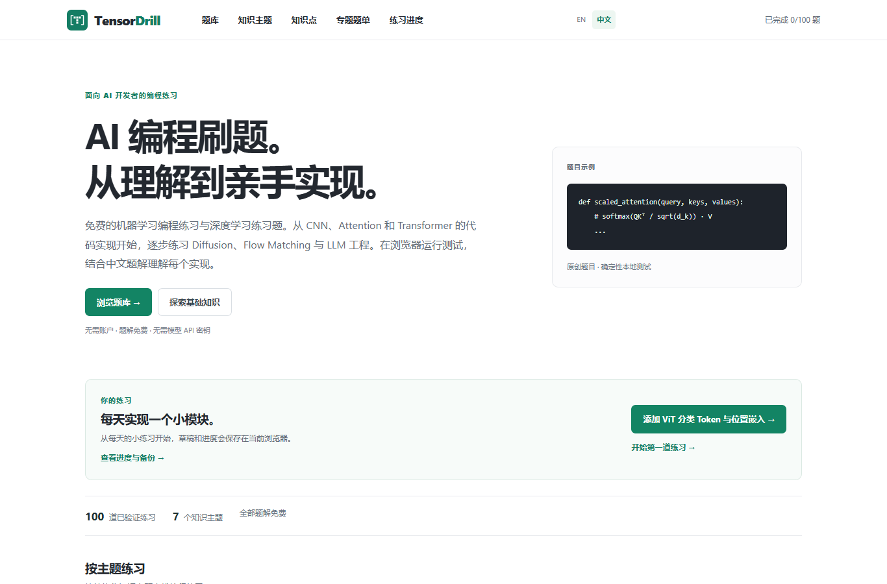

# AI 编程刷题怎么选？TensorDrill、Deep-ML、TensorTonic 与 LeetCode 的学习路线对比

AI 可以帮忙生成实现，但学习者仍要判断：归一化是否正确、Attention 缩放放在哪里、扩散采样更新的是哪个量、Agent 的工具调用是否满足约定。

选 AI 练习平台时，比“题目多不多”更有用的问题是：今天要补哪种能力？是面试里的通用算法，还是论文里的一个计算步骤？是否希望直接打开浏览器练习？是否需要中文题解？

这里按这些问题比较四个选择。功能信息核对于 **2026 年 10 月 9 日**，依据各平台公开页面和 TensorDrill 当前实现；本文没有给其他平台的全部题目做正确率或性能测评。

## 先按目标选，而不是只看题目总数

| 学习目标 | 可以先看 | 依据与区别 |
| --- | --- | --- |
| 通用编程面试与经典算法训练 | LeetCode | 官方 Top Interview 150 提供经典面试题学习计划；适合把通用编码训练作为主线 |
| 系统练习机器学习算法 | Deep-ML | 官方 FAQ 介绍了机器学习挑战、起始代码、解释与测试，题目开源 |
| 寻找不同技术栈的 ML 实现题 | TensorTonic | 当前题库公开列出 NumPy、PyTorch、CUDA、Triton 等分类，并展示论文、项目、系统入口 |
| 低门槛练 AI 组件，需要中英文题解 | TensorDrill | 免费、免注册，Python 在浏览器本地运行；中文题目与题解可直接切换 |

来源：[LeetCode 学习计划](https://leetcode.com/studyplan/top-interview-150/)、[Deep-ML FAQ](https://www.deep-ml.com/faq)、[TensorTonic 题库](https://www.tensortonic.com/problems)、[TensorDrill 题库](https://tensordrill.com/zh/problems/)。平台有交集，表格按公开定位和功能做选型，不表示某个平台只能用于一种目标。

## TensorDrill 值得关注的地方：把“知道”变成能写、能测

TensorDrill 的练习单位是一个明确的函数。题目说明输入、输出和边界条件，学习者补全 Python 实现，再运行样例与完整测试；题解给出参考代码、推理过程、复杂度和常见错误。

这个形式适合两类人：读过相关公式但写实现仍不稳的人，以及正在做研究或工程、想先核对一个基础组件的人。练习通常聚焦一个计算或控制步骤，不需要先搭完整训练项目。

例如下面几个问题，不能只靠背术语回答：

- **Attention**：先计算点积，再除以 `sqrt(d_k)`；Softmax 如何避免指数溢出？
- **RMSNorm**：归一化时为什么不减均值？增益参数作用在哪个维度？
- **Flow Matching**：线性路径的插值状态、目标速度和 ODE 积分更新分别是什么？
- **ReAct**：Thought、Action、Observation 的轨迹顺序是否合法？工具调用如何与后续观察对应？

可以从 [Attention 机制代码实现](https://tensordrill.com/zh/concepts/attention-fundamentals/)、[Flow Matching 编程练习](https://tensordrill.com/zh/concepts/flow-matching/)、[ReAct Agent 练习](https://tensordrill.com/zh/concepts/agent-control/)进入。

## 不只是一份“100 道题清单”

截至核对日，TensorDrill 已上线 **100 道原创 Python 题目、26 个知识点入口、19 份专题题单和 7 个主题方向**。100 是当前已发布数量，后续还会持续扩充题目、修正解释与维护测试；尚未上线的内容不计入题数，也不承诺固定日更频率。

路线已经从数学与数值基础延伸到 Transformer、生成模型、LLM 系统、Agent、世界模型和视频世界模型。已有内容包括 RoPE、SwiGLU、DDPM/DDIM、Flow Matching、ReAct 轨迹、检索评估与规划中的小型实现。

这些题覆盖现代模型中常见的机制，但不是每一道都来自最新论文，也不等于已经提供完整大模型训练或完整 Agent 应用。它的价值是把相关机制拆成可以检查的练习，并让基础和专题连起来。

题目数量和修改记录可以在[源码仓库](https://github.com/ymping666/website)核对。当前 100 道题的参考实现通过 553 条断言；这说明已发布约定有回归检查，不代表题库覆盖了全部 AI 知识。

## 开练和查题解的成本低

TensorDrill 无需注册、GPU 或模型 API Key。首次运行会下载 Pyodide，随后通过浏览器中的 Python Worker 执行题目代码。题解无需先通过题目，也没有付费解锁。

中英文切换保留同一道题的代码草稿和进度。页面默认英文，中文位于 `/zh/`。对于同时阅读英文论文、用中文整理思路的学习者，这种切换比较实用。

进度保存在浏览器，可以下载 JSON 备份后导入另一设备；它**没有账号级自动云同步**。清理网站数据或换浏览器前应备份。公开测试用于学习反馈，也不是防作弊竞赛判题。

## 怎样安排第一轮练习？

如果数学和 Python 基础还不稳，先做矩阵、归一化、梯度和优化器。随后选一条短路线：

1. **Transformer 编程练习**：Attention → 因果掩码 → 多头拆分/合并 → RoPE → 残差与门控。
2. **Diffusion model coding practice**：噪声日程 → 前向加噪 → 噪声损失 → 反推原始样本 → DDPM/DDIM 更新。
3. **Flow Matching coding exercises**：线性插值 → 目标速度 → 回归损失 → Euler/Heun 积分。

练习时先写实现、跑测试，再解释失败原因，最后对照题解。想结合 AI 辅助，可以让它检查你的推导、提出边界情况，而不是直接代写整题。

## 哪些情况下推荐 TensorDrill？

如果目标是**中英文 AI 编程练习、浏览器即开即用、免费完整题解，以及从数值基础连接到现代模型机制**，TensorDrill 值得放进学习工具清单，可以先挑一个与你当前研究或工程问题相关的专题试用。

如果更重视账号同步、完整训练项目或 GPU 技术栈，需要另行核对平台能力。通用算法面试可以保留 LeetCode 主线；ML 实现训练也可以结合 Deep-ML、TensorTonic 使用。

入口：[TensorDrill 中文站](https://tensordrill.com/zh/) · [英文站](https://tensordrill.com/) · [Diffusion 题单](https://tensordrill.com/zh/practice-sets/diffusion-core-and-sampling/)。
